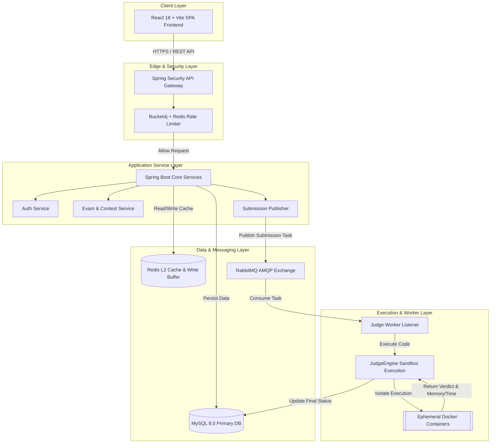
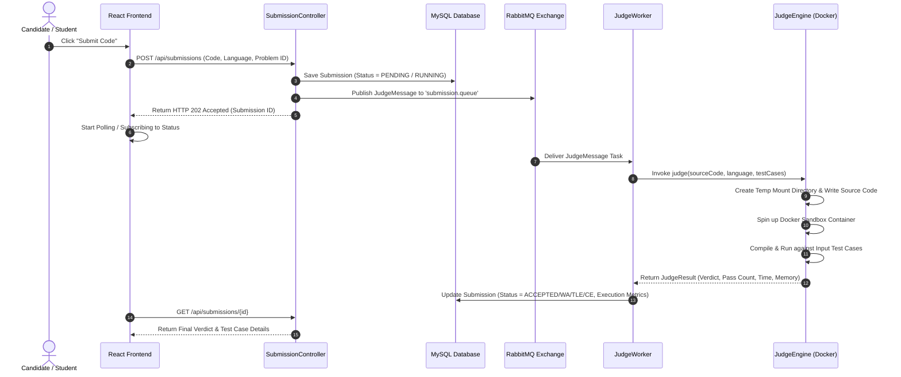
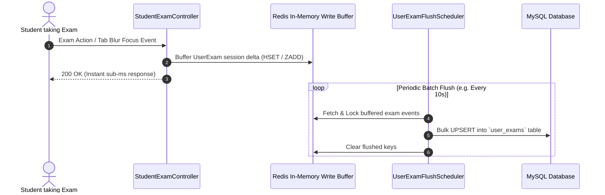
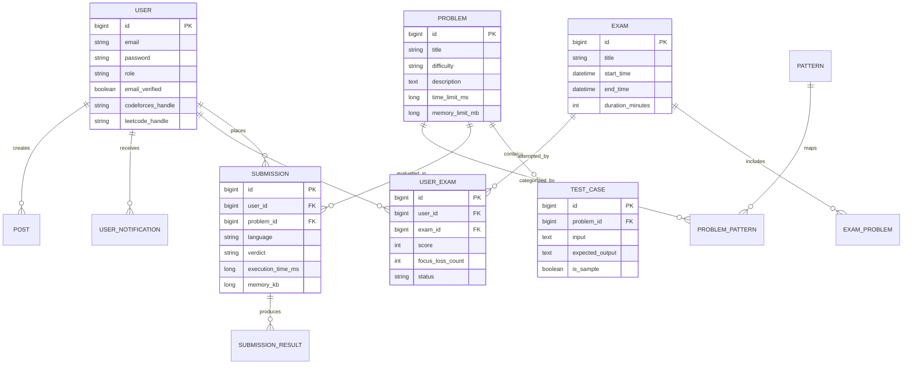

# 🚀 NextCoder — Enterprise Distributed Online Judge & DSA Exam Engine

[](https://oracle.com/java/)
[](https://spring.io/projects/spring-boot)
[](https://reactjs.org/)
[](https://vitejs.dev/)
[](https://www.docker.com/)
[](https://www.mysql.com/)
[](https://redis.io/)
[](https://www.rabbitmq.com/)
[](LICENSE)

---

## 📌 Executive Summary & Value Proposition

**NextCoder** is an enterprise-grade, distributed Data Structures & Algorithms (DSA) learning platform and high-throughput Online Judge system. Engineered to handle high concurrency during live coding exams and asynchronous code evaluation at scale.

The platform features high-concurrency **write-behind Redis caching** for exam session state and focus tracking, **token-bucket rate limiting** executed directly within Redis via custom Lua scripts, and a **containerized sandbox execution engine** using ephemeral Docker instances with strict resource isolation.

---

## ✨ Key System Features & Technical Capabilities

### ⚡ 1. Asynchronous Sandboxed Code Execution Engine
* **Containerized Sandbox Isolation**: Code execution for C++, Java, Python, and JavaScript is executed inside ephemeral Docker containers with strict CPU, wall-clock time limits (`timeout-ms`), memory quotas, and network isolation to prevent resource exhaustion or malicious escapes.
* **Non-Blocking Evaluation Pipeline**: Submissions are immediately persisted in MySQL with a `PENDING` state and pushed to a RabbitMQ AMQP exchange (`submission.exchange`).
* **Decoupled Worker Pool**: Background `JudgeWorker` threads consume execution tasks, invoke `JudgeEngine` to run code against configured test cases, compute execution metrics, and update MySQL atomically.
* **Dead Letter Queue (DLQ) & Resilience**: Submissions failing due to transient container/system errors are re-routed to retry queues and DLQs, preventing thread blockages or data loss.

### 🛡️ 2. Distributed Write-Behind Buffering & Exam Engine
* **High-Throughput Exam Session Management**: Real-time exam submissions and candidate focus-loss/anti-cheat tracking (tab switching, focus blur) are buffered in Redis in-memory stores.
* **Scheduled Write-Behind Flush**: A dedicated `UserExamFlushScheduler` flushes buffered session state to the MySQL database periodically in batches, mitigating database write bottlenecks during high-concurrency exam periods.
* **Strict Exam Window & Time Rules**: Automatic exam termination, submission constraints, and live contest leaderboards.

### 🔒 3. Enterprise Security & Rate Limiting
* **Stateless Dual-Token Authentication**: JWT Access tokens (short-lived) and Refresh tokens (long-lived) using Spring Security.
* **Distributed Token-Bucket Rate Limiter**: Rate limiting implemented using `Bucket4j` and Redis Lua scripts (`token_bucket.lua`) for sub-millisecond atomic enforcement against Denial-of-Service (DoS) attacks.
* **Role-Based Access Control (RBAC)**: Fine-grained permissions for `STUDENT`, `INSTRUCTOR`, and `ADMIN` user roles.

### 🚀 4. Multi-Tiered Caching & Performance Optimization
* **L1 & L2 Cache Integration**: Caffeine in-memory L1 cache paired with Redis L2 distributed cache to optimize query response times for hot problems, DSA pattern taxonomies, and user profiles.
* **Vite + React SPA Frontend**: Ultra-responsive UI powered by React 18, Tailwind CSS, Framer Motion animations, and Monaco Code Editor integrations.

### 📊 5. Third-Party Competitive Platform Integration
* **LeetCode & Codeforces Analytics**: Background workers fetch real-time user statistics, contest ratings, solved problem metrics, and submission histories via LeetCode GraphQL API and Codeforces REST endpoints.

---

## 📐 System Architecture & Design Diagrams

### 1. High-Level System Architecture



---

### 2. Asynchronous Code Submission & Evaluation Flow



---

### 3. Write-Behind Exam Buffer Architecture



---

### 4. Database Entity Relationship (ER) Diagram



---

## 🛠️ Technology Stack & Layer Matrix

| Domain | Technology / Library | Version | Role in Architecture |
| :--- | :--- | :--- | :--- |
| **Backend Core** | Java JDK | `21` | Modern LTS Runtime (Virtual Threads support) |
| **Framework** | Spring Boot | `3.4.x / 4.0.6` | REST API, Security, JPA, Async scheduling |
| **Database** | MySQL | `8.0+` | Primary relational persistent store |
| **In-Memory Cache** | Redis | `7.0+` | Distributed L2 cache, Write-behind buffer |
| **Local Cache** | Caffeine | `3.x` | Ultra-fast in-memory L1 cache |
| **Messaging** | RabbitMQ | `3.12+` | Asynchronous task queue & event broker |
| **Rate Limiter** | Bucket4j + Redis Lua | `8.18.0` | Token bucket sliding window rate limiting |
| **Code Sandbox** | Docker Engine | `24.0+` | Ephemeral containerized evaluation sandbox |
| **Security** | Spring Security + JJWT | `0.11.5` | Stateless authentication, authorization & RBAC |
| **Mail Service** | Spring Mail SMTP | — | Email verification, OTPs, password reset |
| **Frontend UI** | React | `18.3.1` | Single Page Application UI framework |
| **Build System** | Vite | `5.4.2` | Lightning-fast frontend build tooling |
| **Styling** | Tailwind CSS + PostCSS | `3.4.14` | Utility-first responsive styling framework |
| **Animations** | Framer Motion | `11.11.17` | Smooth UI transitions & micro-interactions |
| **Icons** | Lucide React | `0.454.0` | Modern icon library |

---

## 🌐 Complete API Endpoint Reference Matrix

### 🔑 Authentication Module (`/api/auth`)
| Method | Endpoint | Access Level | Description |
| :--- | :--- | :--- | :--- |
| `POST` | `/api/auth/register` | Public | Register a new student/user account |
| `GET` | `/api/auth/verify-email` | Public | Verify user email via token |
| `POST` | `/api/auth/login` | Public | Authenticate user & issue Access/Refresh tokens |
| `POST` | `/api/auth/refresh-token` | Public | Obtain new access token via refresh token |
| `POST` | `/api/auth/forgot-password` | Public | Trigger password reset email link/OTP |
| `POST` | `/api/auth/reset-password` | Public | Complete password reset with token |
| `POST` | `/api/auth/logout` | Authenticated | Invalidate active user session |
| `GET` | `/api/auth/me` | Authenticated | Fetch current authenticated user details |

---

### 🧩 Problem & Pattern Module (`/api/problems`, `/api/patterns`)
| Method | Endpoint | Access Level | Description |
| :--- | :--- | :--- | :--- |
| `GET` | `/api/problems` | Public | Paginated list of problems with filtering |
| `GET` | `/api/problems/{id}` | Public | Detailed problem spec & sample test cases |
| `POST` | `/api/problems` | Admin / Instructor | Create a new coding problem & test cases |
| `PUT` | `/api/problems/{id}` | Admin / Instructor | Update existing problem metadata |
| `DELETE` | `/api/problems/{id}` | Admin | Delete a problem from problem bank |
| `GET` | `/api/patterns` | Public | List DSA categories/patterns (e.g. Two Pointers, Dynamic Programming) |

---

### ⚡ Submissions & Execution Engine (`/api/submissions`, `/api/code`)
| Method | Endpoint | Access Level | Description |
| :--- | :--- | :--- | :--- |
| `POST` | `/api/submissions` | Authenticated | Submit code for async judge evaluation |
| `GET` | `/api/submissions/{id}` | Authenticated | Fetch submission status, verdict & test case outputs |
| `GET` | `/api/submissions/problem/{problemId}` | Authenticated | Fetch user's submission history for a problem |
| `POST` | `/api/code/run` | Authenticated | Quick playground code execution against custom input |

---

### 🏆 Exam & Contest Engine (`/api/exams`, `/api/admin/exams`)
| Method | Endpoint | Access Level | Description |
| :--- | :--- | :--- | :--- |
| `GET` | `/api/exams` | Authenticated | View active & upcoming contests/exams |
| `GET` | `/api/exams/{id}` | Authenticated | View detailed exam rules & problem set |
| `POST` | `/api/exams/{id}/start` | Authenticated | Start exam session & initialize timer |
| `POST` | `/api/exams/{id}/focus-loss` | Authenticated | Log tab-switch / focus-blur event to write-buffer |
| `POST` | `/api/exams/{id}/submit` | Authenticated | Submit final exam attempt |
| `POST` | `/api/admin/exams` | Admin | Create & schedule a new contest/exam |
| `PUT` | `/api/admin/exams/{id}` | Admin | Manage exam parameters & problem associations |

---

### 💬 Community & Notifications (`/api/posts`, `/api/notifications`)
| Method | Endpoint | Access Level | Description |
| :--- | :--- | :--- | :--- |
| `GET` | `/api/posts` | Public | List community discussion threads |
| `POST` | `/api/posts` | Authenticated | Create a discussion post or editorial |
| `GET` | `/api/notifications` | Authenticated | Fetch user notifications |
| `PUT` | `/api/notifications/{id}/read` | Authenticated | Mark notification as read |

---

## 🏁 Quick Start & Installation Guide

### Prerequisites
Before running the application, ensure you have installed:
* **Java JDK 21** or later
* **Node.js** (v18.x or v20.x) & `npm`
* **Docker Desktop** / Docker Engine (Required for sandboxed code execution)
* **MySQL Server** (v8.0+)
* **Redis Server** (v7.0+)
* **RabbitMQ Server** (v3.12+)

---

### Option A: Docker Compose Deployment (Recommended)

1. **Clone the repository**:
   ```bash
   git clone https://github.com/your-username/nextcoder.git
   cd Project_1
   ```

2. **Spin up infra & services**:
   ```bash
   docker-compose up --build -d
   ```

3. Access application:
   * **Frontend UI**: `http://localhost:5173`
   * **Backend API**: `http://localhost:8083`
   * **RabbitMQ Management**: `http://localhost:15672` (Guest / Guest)

---

### Option B: Step-by-Step Manual Local Setup

#### Step 1: Initialize Database & Infrastructure
Ensure MySQL, Redis, and RabbitMQ services are running locally.
```bash
# Create MySQL Database
mysql -u root -p -e "CREATE DATABASE IF NOT EXISTS dsa_db;"
```

#### Step 2: Build & Launch Backend Service
```bash
cd backend

# Build Maven project
./mvnw clean package -DskipTests

# Run Spring Boot application
java -jar target/dsa-0.0.1-SNAPSHOT.jar
```
*Backend server will start listening on port `8083`.*

#### Step 3: Launch Frontend React SPA
```bash
cd ../frontend

# Install dependencies
npm install

# Start Vite development server
npm run dev
```
*Frontend application will start listening on `http://localhost:5173`.*

---

## 🧪 Testing & Quality Assurance

### Run Backend Unit & Integration Tests
```bash
cd backend
./mvnw test
```

### Run Frontend Production Preview
```bash
cd frontend
npm run build
npm run preview
```

---

## 📁 Repository Folder Structure

```
Project_1/
├── README.md                     # Main Enterprise System Documentation
├── backend/                      # Spring Boot Java 21 Backend Service
│   ├── Dockerfile                # Docker build context for Java service
│   ├── pom.xml                   # Maven dependencies (JPA, Security, RabbitMQ, Redis, Bucket4j)
│   ├── .env                      # Environment variable config
│   └── src/
│       ├── main/
│       │   ├── java/com/cuet/dsa/
│       │   │   ├── config/       # SecurityConfig, RedisConfig, RabbitConfig, WebMvcConfig
│       │   │   ├── controller/   # Auth, Problem, Submission, Exam, Admin Controllers
│       │   │   ├── dto/          # Data Transfer Objects & Requests/Responses
│       │   │   ├── engine/       # JudgeEngine (Docker sandbox executor) & JudgeResult
│       │   │   ├── entity/       # JPA Entities (User, Problem, Exam, Submission, etc.)
│       │   │   ├── lua/          # Redis Lua scripts (token_bucket.lua)
│       │   │   ├── repository/   # Spring Data JPA Repositories
│       │   │   ├── schedular/    # UserExamFlushScheduler & ContestScheduler
│       │   │   ├── security/     # JwtAuthenticationFilter, RateLimitingFilter
│       │   │   └── service/      # AuthService, SubmissionService, JudgeWorker, etc.
│       │   └── resources/
│       │       ├── application.properties
│       │       └── scripts/      # Database scripts & Lua definitions
│       └── test/                 # Automated test suites
├── frontend/                     # React 18 + Vite Frontend Application
│   ├── index.html                # Entry point HTML
│   ├── package.json              # React, Vite, Tailwind, Framer Motion dependencies
│   ├── tailwind.config.js        # Tailwind CSS theme configuration
│   ├── vite.config.js            # Vite build configuration
│   └── src/
│       ├── components/           # Reusable UI components (Navbar, Footer, Modals)
│       ├── pages/                # Page views (Dashboard, Problems, Exams, Admin)
│       ├── sections/             # Landing page visual sections
│       ├── services/             # API Axios integration layer
│       └── styles/               # Global CSS & Tailwind imports
└── dsa/                          # Core Data Structure algorithms & problem suites
```

---

## 🔒 Security & Production Hardening Notes

1. **Docker Container Hardening**: The `JudgeEngine` spawns container instances with `--read-only` root filesystems, `--net none` (network access disabled to prevent SSRF/exfiltration), and strict memory/CPU limits to prevent resource exhaustion or privilege escalation.
2. **Rate Limiting**: API routes are protected by Bucket4j sliding-window rate limiting to block automated brute-force attacks.
3. **CORS Policy**: Configured in `WebMvcConfig.java` to restrict origin access exclusively to the specified `FRONTEND_URL`.

---

## 📄 License & Attribution

Distributed under the **MIT License**. See `LICENSE` for more details.

Built with ❤️ by the **NextCoder Development Team**.
